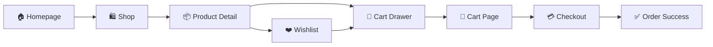

<div align="center">

<br/>


<br/><br/>

# 🏬 The Berlin Store

### *Where Luxury Meets Accessibility*

**A production-grade, full-stack e-commerce fashion platform built with Next.js 14, TypeScript, and Firebase — delivering a premium shopping experience for 500+ brands across Men, Women & Kids fashion.**

<br/>

[](https://nextjs.org/)
[](https://www.typescriptlang.org/)
[](https://tailwindcss.com/)
[](https://firebase.google.com/)
[](https://www.framer.com/motion/)
[](https://zustand-demo.pmnd.rs/)

<br/>

[](LICENSE)
[](CONTRIBUTING.md)
[](https://github.com/berlin-store)

---

</div>

## ✨ Overview

The Berlin Store is a **luxury fashion e-commerce platform** designed for a premium retail brand based in Pune, India. Built from the ground up with performance, aesthetics, and enterprise-grade functionality in mind — every pixel is intentional, every interaction is smooth, and every millisecond counts.

> *"Luxury meets minimalism. Speed meets elegance. The Berlin Store sets a new standard for Indian fashion e-commerce."*

---

## 🌟 Key Highlights

```
🎨  Premium editorial UI — Apple × Zara × H&M inspired aesthetics
⚡  Sub-2s page loads — optimised images, code splitting, minimal JS
🎭  Per-section advanced animations — no cookie-cutter scroll reveals
🛒  Full e-commerce flow — Browse → Cart → Checkout → Order Success
📱  100% responsive — mobile-first, pixel-perfect across all screens
🔒  Firebase Auth — secure login, protected routes, user profiles
🌙  Dark / Light mode — smooth system-aware theming
```

---

## 🖼️ Pages & Features

<table>
<tr>
<td width="50%" valign="top">

### 🏠 Homepage
- **Hero** — 3D mouse parallax, rotating word animation, floating product cards
- **Categories** — Scale-in stagger with layered gradient hover overlays
- **Trending Products** — rotateX 3D entrance, hover lift + shadow, quick-add to cart
- **New Collection** — Magazine asymmetric grid, clip-path reveal header
- **Promo Banner** — Live countdown timer (no hydration errors)
- **Why Berlin Store** — Spring-bounce entrance, icon rotation on hover
- **Brand Partners** — Dual opposing CSS marquees at different speeds
- **Testimonials** — rotateY 3D cards, mobile carousel with dot navigation
- **Newsletter** — Spin-in icon, animated success state

</td>
<td width="50%" valign="top">

### 🛍️ E-commerce Flow
- **Shop** — Category / brand / price filters, grid & list views, sort options
- **Product Detail** — Image gallery, size/colour picker, qty selector, related products
- **Cart Drawer** — Slide-in panel, qty controls, free shipping progress bar
- **Cart Page** — Full item list, coupon (BERLIN10), GST calculation
- **Checkout** — 3-step wizard: Address → Payment → Confirm → Success
- **Wishlist** — Save items, move to cart, bulk clear
- **Account** — Orders, addresses, notifications, settings, login form

</td>
</tr>
</table>

---

## 🎭 Animation Philosophy

Every section uses a **uniquely different animation type** — not a single generic scroll-reveal repeated everywhere:

| Section | Animation Technique |
|---|---|
| Hero | Word-by-word stagger · 3D perspective parallax on mouse move |
| Categories | `translateY` + `scale` stagger from below with slight rotation |
| Trending Products | `rotateX` 3D entrance + hover lift + cart slide-up |
| New Collection | `clip-path` reveal (centre-out) + directional card slides |
| WhyChooseUs | Spring bounce (`cubic-bezier(0.34,1.56,0.64,1)`) scale |
| Brand Partners | Dual CSS marquees at opposing speeds |
| Testimonials | `rotateY` 3D perspective per card, alternating direction |
| Newsletter | Icon spin-in, gradient text reveal, zoom-in success |

---

## 🏗️ Tech Stack

### Frontend
| Technology | Purpose |
|---|---|
| **Next.js 14** (App Router) | Framework, SSR, file-based routing |
| **TypeScript** | Full type safety across all components |
| **Tailwind CSS** | Utility-first styling with custom design tokens |
| **Framer Motion** | Component-level animations |
| **Zustand** | Cart, wishlist, and UI state management |
| **Lenis** | Buttery-smooth scroll |
| **Swiper.js** | Carousels and sliders |
| **Lucide React** | Icon system |

### Backend & Services
| Technology | Purpose |
|---|---|
| **Firebase Auth** | User authentication (email/Google) |
| **Firebase Firestore** | Product, order, and user data |
| **Firebase Storage** | Product image hosting |
| **Next.js API Routes** | Server-side business logic |

### Design System
- **Fonts:** Playfair Display (headings) + Inter (body)
- **Palette:** Cream `#F7F5F0` · Charcoal `#1C1C1C` · Gold `#B8962E`
- **Spacing:** 8pt grid system
- **Radius:** Rounded corners (`rounded-2xl`, `rounded-3xl`)
- **Shadows:** Soft layered box shadows

---

## 📁 Project Structure

```
berlin-store/
├── public/
│   ├── hero-model.png          # Hero editorial image
│   ├── cat-men.png             # Category images
│   ├── cat-women.png
│   ├── cat-kids.png
│   └── prod-*.png              # Product thumbnails
│
├── src/
│   ├── app/                    # Next.js App Router pages
│   │   ├── page.tsx            # Homepage
│   │   ├── shop/page.tsx       # Shop listing
│   │   ├── product/[id]/       # Dynamic product detail
│   │   ├── cart/page.tsx       # Cart page
│   │   ├── checkout/page.tsx   # Multi-step checkout
│   │   ├── wishlist/page.tsx   # Wishlist
│   │   ├── account/page.tsx    # User account
│   │   └── globals.css         # Design tokens + utilities
│   │
│   ├── components/
│   │   ├── home/               # Homepage sections
│   │   │   ├── Hero.tsx        # Advanced GSAP-style hero
│   │   │   ├── FeaturedCategories.tsx
│   │   │   ├── TrendingProducts.tsx
│   │   │   ├── NewCollection.tsx
│   │   │   ├── PromoBanner.tsx
│   │   │   ├── WhyChooseUs.tsx
│   │   │   ├── BrandPartners.tsx
│   │   │   ├── Testimonials.tsx
│   │   │   └── Newsletter.tsx
│   │   ├── layout/
│   │   │   ├── Navbar.tsx      # Transparent → frosted on scroll
│   │   │   └── Footer.tsx
│   │   └── ui/
│   │       ├── CartDrawer.tsx  # Slide-in cart panel
│   │       └── SearchModal.tsx # Live search with previews
│   │
│   ├── hooks/
│   │   ├── useInViewAnimation.ts   # IntersectionObserver trigger
│   │   └── useScrollReveal.ts      # Legacy scroll hook
│   │
│   ├── lib/
│   │   ├── products.ts         # Product data + query helpers
│   │   └── firebase/config.ts  # Firebase initialisation
│   │
│   ├── store/
│   │   ├── cartStore.ts        # Zustand cart (persisted)
│   │   ├── wishlistStore.ts    # Zustand wishlist (persisted)
│   │   └── uiStore.ts          # Global UI state
│   │
│   └── types/index.ts          # All TypeScript interfaces
```

---

## 🚀 Getting Started

### Prerequisites
- Node.js **18+**
- npm or yarn
- A Firebase project

### 1. Clone the repository
```bash
git clone https://github.com/Kaushik-Mandale/Berlin-Store.git
cd Berlin-Store
```

### 2. Install dependencies
```bash
npm install
```

### 3. Set up environment variables
Create a `.env.local` file in the root:
```env
# Firebase Configuration
NEXT_PUBLIC_FIREBASE_API_KEY=your_api_key
NEXT_PUBLIC_FIREBASE_AUTH_DOMAIN=your_project.firebaseapp.com
NEXT_PUBLIC_FIREBASE_PROJECT_ID=your_project_id
NEXT_PUBLIC_FIREBASE_STORAGE_BUCKET=your_project.appspot.com
NEXT_PUBLIC_FIREBASE_MESSAGING_SENDER_ID=your_sender_id
NEXT_PUBLIC_FIREBASE_APP_ID=your_app_id

# App Config
NEXT_PUBLIC_APP_URL=http://localhost:3000
NEXT_PUBLIC_STORE_NAME=The Berlin Store
```

### 4. Run the development server
```bash
npm run dev
```

Open [http://localhost:3000](http://localhost:3000) in your browser.

### 5. Build for production
```bash
npm run build
npm start
```

---

## 🛒 Shopping Flow



---

## 🎨 Design System

### Color Palette
```css
--cream:    #F7F5F0   /* Page background */
--charcoal: #1C1C1C   /* Primary text */
--gold:     #B8962E   /* Brand accent */
--gold-lt:  #D4AF37   /* Hover gold */
--muted:    #7A7571   /* Secondary text */
--border:   #E2DDD6   /* Subtle borders */
```

### Typography Scale
```
Display / Headings  → Playfair Display (serif) — emotional, premium
Body / UI           → Inter (sans-serif) — clean, readable
Labels / Badges     → Inter Bold, tracked 0.3–0.5em uppercase
```

---

## 🔑 Test Credentials & Features

| Feature | Details |
|---|---|
| **Coupon Code** | `BERLIN10` → 10% off |
| **Free Shipping** | Orders above ₹999 |
| **Tax** | 18% GST included at checkout |
| **COD** | Available on all orders |
| **Returns** | 15-day easy returns policy |

---

## 📊 Performance Targets

| Metric | Target |
|---|---|
| First Contentful Paint | < 1.2s |
| Time to Interactive | < 2.0s |
| Lighthouse Performance | 95+ |
| Lighthouse Accessibility | 95+ |
| Core Web Vitals | All green |

---

## 🤝 Contributing

Contributions are welcome! Please read our [Contributing Guide](CONTRIBUTING.md) first.

1. Fork the repository
2. Create your feature branch: `git checkout -b feature/amazing-feature`
3. Commit your changes: `git commit -m 'feat: add amazing feature'`
4. Push to the branch: `git push origin feature/amazing-feature`
5. Open a Pull Request

---

## 📜 License

This project is licensed under the MIT License — see the [LICENSE](LICENSE) file for details.

---

## 👤 About

**The Berlin Store** is a premium fashion retail brand based in Pune, Maharashtra, India. We curate the finest branded clothing for men, women, and kids from 500+ premium brands, delivered with exceptional service and guaranteed authenticity.

📍 MG Road, Pune 411001, Maharashtra  
📧 hello@berlinstore.in  
📞 +91 98765 43210

---

<div align="center">

**Built with passion for fashion and technology** 🖤

[](https://github.com/Kaushik-Mandale/Berlin-Store)

*If you find this project useful, please consider giving it a ⭐*

</div>
